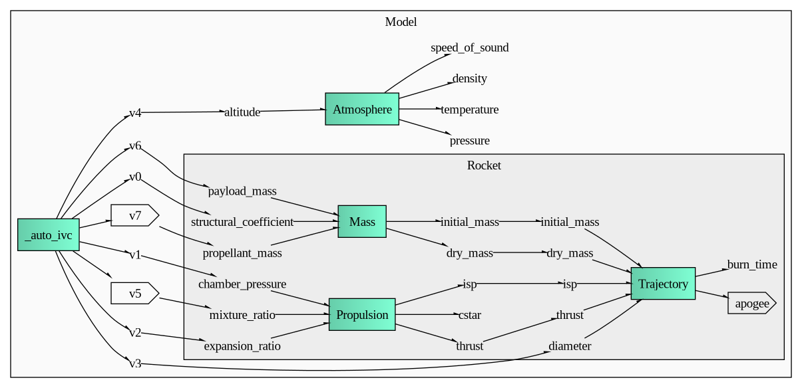

# TODOs

In descending order of importance:

- [ ] Update documentation!

- [ ] MDAO class structure

  - [x] Basic setup

  - [x] Fix trajectory calculator and unrealistic optimization outputs -- caused
        by lack of a drag model

    - [x] Implement an atmospheric model

    - [x] Implement a drag model

  - [ ] Refine the propulsion class/component to include subgroups within the
        propulsion assembly

    - [x] Injector

    - [x] Nozzle

    - [ ] Fuel stack

  - [x] ~~Aerodynamics component~~ Necessary for apogee calculator

  - [ ] Figure out a reasonable class structure for rocket form factor
        parameters (diameter etc.)

  - [ ] Implement an MDAO `Problem` class that abstracts optimization problems

- [ ] Implement proper mass calculations to replace the rudimentary structural
      coefficient model

- [ ] Figure out the correct chemistry of CEA reactants, specifically reactant
      temperatures and enthalpies of formation

- [ ] Move optimization options and inputs from `solver.py` to JSON files in
      `inputs/`

- [x] Fix RocketCEA's garbage folders (see [note](#rocketcea-note))

- [ ] Move to a JSON5 parsing library to allow for C++-style comments in inputs
      files

# BEARS Rocket Solver

This program aims to implement highly general multi-dimensional
multi-disciplinary optimization for the whole rocket assembly

## Design principles

> Programs must be written for people to read, and only incidentally for
> machines to execute
>
> -- Harold Abelson

This program aims for generality, and general programs must be understandable to
be reusable. Code clarity and readability is top priority

The hope of organizing the code into MDAO class structure is that each layer of
assembly may be understood from its inputs and outputs independent from the
others, with one central, clearly defined function mapping between the two

## Code structure

```
bears_rocket_solver
├── solver.py                   # Central calculation script
├── inputs                      # Solver configuration JSON files
│   └── ...
├── modules
│   ├── BEARS_Atmo              # Atmospheric model package
│   │   ├── atmo.py
│   │   └── ...
│   ├── BEARS_Chem              # CEA propellant chemistry module
│   │   ├── chem.py
│   │   └── ...
│   └── BEARS_Rocket            # MDAO class structure module
│       ├── comp_chem.py        # - Propulsion chemistry component
│       ├── comp_tank.py        # - Tank component
│       ├── comp_injector.py    # - Tank-to-fuel injector and plumbing comp
│       ├── comp_nozzle.py      # - Nozzle parameters component
│       ├── group_prop.py       # - Propulsion group, connects the tank,
│       │                       #   injector, nozzle and reaction chemistry
│       │                       #   components
│       ├── comp_mass.py        # - Mass profile component, connects payload,
│       │                       #   propellant, and structural mass
│       │                       #   calculations
│       ├── comp_traj.py        # - Trajectory and aerodynamics component
│       ├── group_rocket.py     # - Rocket assembly group, assembles
│       │                       #   everything above
│       └── ...
├── outputs                     # Solver output files for calculated values
│   └── ...
├── figures                     # Figure outputs
│   └── ...
└ ...
```

`BEARS_Chem`: [CEA](#cea) parser module. Contains functions to read the reactant
data from input JSONs and parse it into a CEA object to be passed to the
propulsion subsystem

`BEARS_Atmo`: Currently uses the
[isacalc](https://github.com/LukeDeWaal/ISA_Calculator)
package for calculating the ISA model parameters from the altitude

`BEARS_Rocket`: Classes for the [OpenMDAO](#openmdao) rocket assembly
structure. Each file defines one component class, and each file is prefixed with
the MDAO component type it defines: `group_`, `comp_`, etc

## MDAO class structure

MDAO organizes the assembly components into a hierarchical tree-like
[class structure](https://openmdao.org/newdocs/versions/latest/theory_manual/class_structure.html).
At the root of the model tree is a `Problem` definition, which contains a
`Group` of interconnected `Component`s or other `Group`s.

The current dataflow structure of our model looks as follows:



Each global input variable (coming out of `_auto_ivc`) can be either fixed or
optimized for. More than one variable can be optimized at once. In the current
`solver.py` script, one can switch between minimizing the propellant mass, or
additionally calculating the optimal oxidizer-to-fuel ratio with CEA

Model components in detail:

| Component | OpenMDAO Class | Inputs | Outputs | Comments |
| --------- | -------------- | ------ | ------- | -------- |
| RocketGroup | Group | - | - | The top-level rocket assembly group. This is where the inputs and outputs of individual subsystems are connected together |
| TrajectoryComponent | ExplicitComponent | `thrust`<br>`isp`<br>`initial_mass`<br>`dry_mass`<br>`diameter` | `apogee` | The trajectory calculator component, including simple drag calculations using the atmospheric model. In the future, this component may also contain the encoding of the flight plan for >1D trajectories |
| MassComponent | ExplicitComponent | `payload_mass`<br>`propellant_mass`<br>`structural_coefficient` | `initial_mass`<br>`dry_mass` | Mass profile of the rocket. Preliminary and will probably be superseded by better calculation methods |
| ChemComponent | ExplicitComponent | `chamber_pressure`<br>`mixture_ratio`<br>`expansion_ratio` | `cstar`<br>`isp`<br>`thrust` | Propulsion chemistry subsystem using the CEA solver. This is to be broken up into further subassemblies: nozzle, fuel stack, tank(, injector?) |

This structure is in early development and is subject to drastic change. This
table will evolve as sub-assemblies are refined

## Running the program

### Setting up the environment

The following Python packages are required:

```bash
openmdao
rocketcea
isacalc

# Structure visualization
pydot
graphviz
```

To initialize a Python virtual environment and install the required packages:

```powershell
python -m venv env

.\env\Scripts\activate  # Windows, or
source env/bin/activate # Linux/WSL

pip install --upgrade pip

# This should automatically pull required dependencies
pip install .
```

(You may need to install `graphviz` on your system, I haven't tested if it
works with plain Python)

### Running the solver

`solver.py` is the main entry point of the program.

On Windows, activate the environment and execute the solver:

```powershell
.\env\Scripts\activate
python3 solver.py
```

On Linux/WSL:

```bash
source env/bin/activate
./solver.py
```

## Package notes

### OpenMDAO

[OpenMDAO](https://openmdao.org/) (Muldi-Disciplinary Analysis and
Optimization) is the multidisciplinary optimizer that ties the whole solver
program together. OpenMDAO works by organizing large calculations into groups
and subsystems with corresponding Python classes

### RocketCEA

[CEA](https://www.nasa.gov/glenn/research/chemical-equilibrium-with-applications/)
is NASA's isentropic chemistry solver written primarily in Fortran. We use CEA
Python wrappers in this program for computing the propulsion chemistry

We use
[RocketCEA](https://rocketcea.readthedocs.io/en/latest/index.html)
instead of the plain
[CEA Python interface](https://nasa.github.io/cea/interfaces/python_api.html)
used in a previous version of the program because this new package is designed
specifically for rocketry development and is somewhat more convenient

CEA doesn't understand the full chemistry of polymer reactants, and polymers
are modelled with a pseudo-species of fixed polymer chain length

ABS properties used in some of the scripts can be found in this table:
[PubChem ABS table](https://pubchem.ncbi.nlm.nih.gov/compound/ACRYLONITRILE-BUTADIENE-STYRENE#section=Computed-Properties)

### ISACALC

[ISACALC](https://github.com/LukeDeWaal/ISA_Calculator) - A very simple Python
calculator for the ISA atmospheric model. May be superseded by an in-house ISA
calculator in the future

Possible alternatives:
- [Ambiance](https://pypi.org/project/ambiance/)
- [Fluids](https://fluids.readthedocs.io/index.html) (`fluids.atmosphere`);
  could be useful for other functions if we ever need detailed fluid dynamics
- [NRL MSISE](https://en.wikipedia.org/wiki/NRLMSISE-00)
